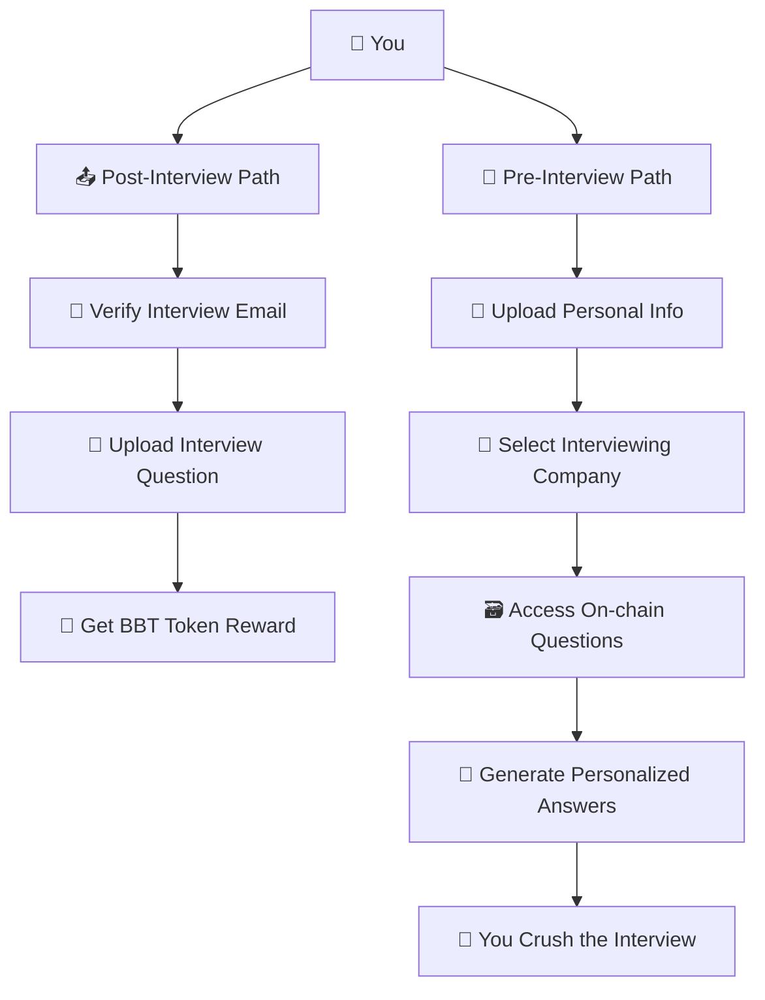

# 🤖 BehavioralBuddy | AI Interview Prep Meets Web3 on Aptos

Canva Presentation: https://www.canva.com/design/DAGnbtfghew/DTlotkk8rRFhMaYIBRH7eA/edit?utm_content=DAGnbtfghew&utm_campaign=designshare&utm_medium=link2&utm_source=sharebutton

YouTube Demo: https://youtu.be/tWL4C_Ozhnw

🎥 [YouTube Demo](https://youtu.be/tWL4C_Ozhnw)
📊 [Pitch Deck](https://www.canva.com/design/DAGnbtfghew/DTlotkk8rRFhMaYIBRH7eA/edit?utm_content=DAGnbtfghew&utm_campaign=designshare&utm_medium=link2&utm_source=sharebutton)

---

## ❌ Behavioral Interviews Suck

Too many questions. No clear answers. Different expectations at every company. Most people just guess what to say — or pay \$\$\$ for coaching.

In 2024, over **\$2.4 billion** was spent on interview coaching alone.

---

## 💡 That’s Why We Built BehavioralBuddy

> 🎤 An AI that generates **perfectly personalized** answers to real behavioral questions — based on:
>
> * Your resume, LinkedIn, and work history
> * The company and role you're applying for

But where do the questions come from?

> ✨ From real people, like you — after their interviews.

We created a two-sided dApp that helps you **prep** better before interviews, and **contribute** after interviews to earn rewards.

---

## 🧠 How It Works

### 👟 Post-Interview Flow (Contribute & Earn)

1️⃣ Upload screenshot proof of your interview invite
2️⃣ Submit the real questions you were asked
3️⃣ Earn **BBT tokens** as a reward 💰

### 📚 Pre-Interview Flow (Prep Smarter)

1️⃣ Paste in your resume + company name
2️⃣ Get **verified, crowdsourced** questions from other candidates
3️⃣ Let the AI generate professional, tailored answers
4️⃣ Edit, rate, or regenerate answers until you're happy

## 🧠 Quick Flow Recap

---

## 🔗 How We Use Aptos

### 🎁 BBT Token

Users earn **BBT** for verified question submissions, built with `aptos_framework::managed_coin`.

### 🧠 On-chain Interview DB

Interview questions are stored **on-chain** by company using `table::Table`, creating a crowdsourced, open-access Q\&A dataset.

### 👤 Wallet = Identity

We use Aptos Wallet as a **pseudonymous identity layer** — no email, no forms, no friction.

> ✅ The more questions you contribute, the more BBT you earn
> 🔍 The more questions you read, the better your interview prep gets

---

## ⚙️ Why Aptos is the Best Fit

| 🔧 Feature                        | 💥 Why It Matters                                        |
| --------------------------------- | -------------------------------------------------------- |
| **Parallel Execution (BlockSTM)** | Scale Q\&A reads + writes with no slowdowns              |
| **Low Fees**                      | Micro-rewards and micro-interactions stay cheap + smooth |
| **Wallet UX**                     | Onboarding without logins = perfect for Web2 job seekers |
| **Safe, Fast Dev in Move**        | Secure resource model lets us iterate fast + reliably    |

> Aptos gives us the **performance, UX, and scale** to support millions of job-seekers worldwide.

---

## 🎯 Vision: A Decentralized Glassdoor

Next, we’re expanding beyond questions to build a **fully decentralized career hub** —
with crowdsourced interview reviews, compensation data, job insights, and more.

---

## 💬 Final Pitch

> 🎯 Join us in reimagining the **\$2.1B interview prep industry** —
> by crowdsourcing real intel, rewarding honest contributions, and delivering AI-powered prep
> with **BehavioralBuddy**, powered by **Aptos**.
>
> Let's help everyone ace the interview — not just those who can afford to.
>
> **Thank you! 🙌😄**
