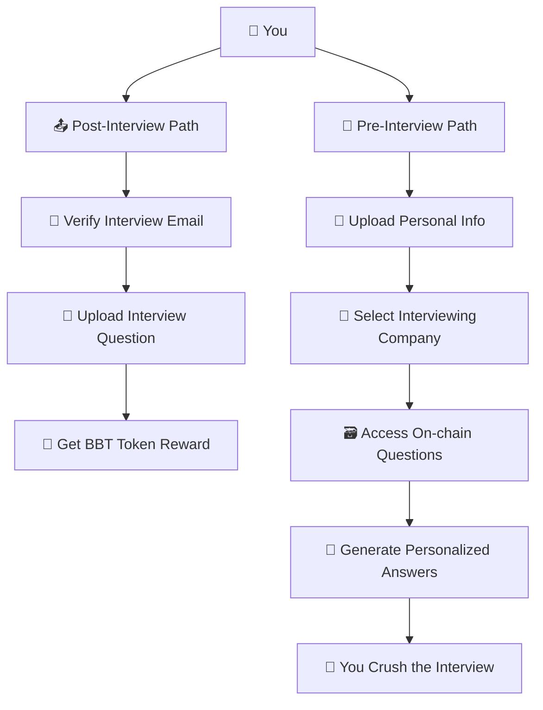

# 🤖 BehavioralBuddy | AI Interview Prep Meets Web3 on Aptos

Canva Presentation: https://www.canva.com/design/DAGnbtfghew/DTlotkk8rRFhMaYIBRH7eA/edit?utm_content=DAGnbtfghew&utm_campaign=designshare&utm_medium=link2&utm_source=sharebutton

YouTube Demo: https://youtu.be/tWL4C_Ozhnw

**Tired of prepping for behavioral interviews? So are we.**
You've got 50+ questions to prepare, and no clue what "good" even looks like.

That's why we built:

> 🎤 **BehavioralBuddy** – an AI-powered dApp that instantly generates polished answers to behavioral interview questions tailored to **you** and the **company** you're applying to.

---

## 🚀 2. How We Use Aptos

### 🎁 BBT: Behavioral Buddy Token

Submit real interview questions and earn **BBT** – our reward token built using Aptos' `managed_coin`.

### 🔐 On-chain Crowdsourcing

We store interview questions **on-chain** by company using Aptos `table::Table`, creating the largest open database of real interview Qs ever.

### 👤 Aptos Wallet = Anonymous Identity

We use your Aptos wallet as a pseudonymous identity — no logins, no tracking. Share only what *you* want.

> ✅ The more value you contribute (real questions), the more BBT you earn.
> 🔍 The more value you get (tailored prep), the better your interview odds.

---

## ⚡ 3. Why Aptos is the Best Fit

| 🧱 Feature                        | 🚀 Why It Matters for Us                                             |
| --------------------------------- | -------------------------------------------------------------------- |
| **Parallel Execution (BlockSTM)** | Users can submit and read questions at scale with **no bottlenecks** |
| **Low Fees**                      | Micro-rewards with BBT stay cheap and sustainable                    |
| **Great Wallet UX**               | Easy login + anonymous identity = zero friction onboarding           |
| **Dev Speed & Safety**            | Move's resource model + dev tooling let us build fast and safe       |

> Aptos is *built* for apps with millions of micro-interactions — like ours.

---

## 🧠 Quick Flow Recap

---

## 🙌 Built for Hackers, by Hackers

BehavioralBuddy helps *you* win the interview game — and helps the whole community prep smarter.

📚 Real data
🎁 Real rewards
🧠 Real prep power
